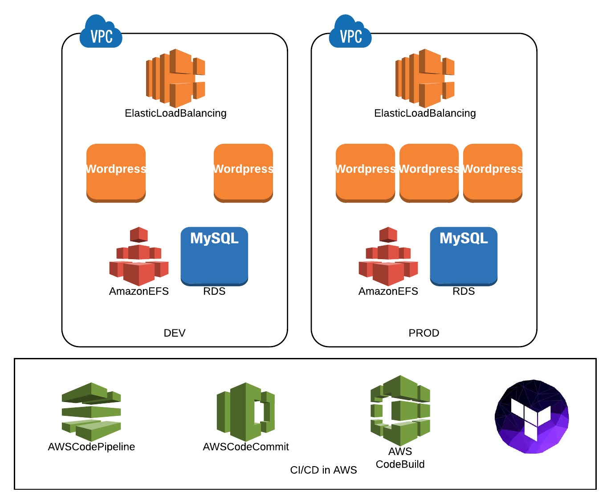
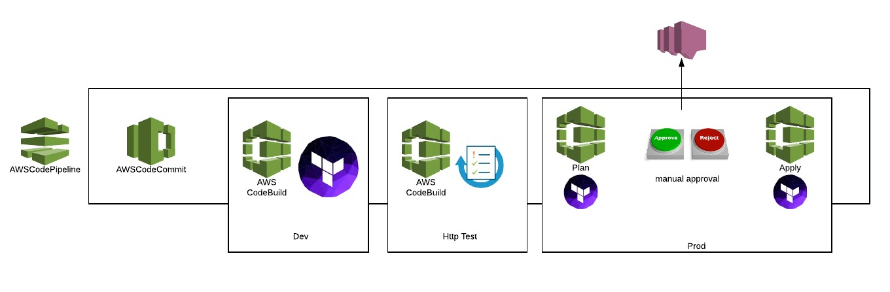

==================================================
DevOps with Terraform
==================================================

Overview
--------
During our session at AWS Loft in Munich on November 22nd we presented “How to deploy AWS Infrastructure in a true DevOps fashion” using Terraform, AWS Codepipeline and AWS Codebuild.

As best practise Cloudreach suggests to deploy infrastructure as a code using AWS Cloudformation, AWS CLI or our tool `Sceptre <https://www.cloudreach.com/cloudreach-sceptre/>`_. For the purpose of this article we will focus on Terraform in order to evaluate a different tool.

Terraform is a general purpose infrastructure construction tool which supports multiple public cloud providers. Although it’s not an abstraction layer allowing users to create infrastructure on any cloud provider using the same code, it is powerful in that the same syntax can be used to create resources in multiple public cloud providers.

Terraform uses its own configuration format (TF) to describe desired infrastructure resources. The TF format also provides for variables, conditionals, and iterators while still being readable. JSON is also supported, as an alternative to the TF format. JSON allows for other tools and languages to leverage Terraform’s wide array of features.

One of Terraform’s most attractive features is how it tracks and maintains its configuration data. Configurations are tracked through the “terraform.tfstate” file, which can be stored locally or in a shared location (e.g. S3 bucket) for collaborative efforts. In the latter case, Terraform provides for execution locks so that the target environment is only manipulated by one Terraform execution at a time, preventing overlapping errors. In those cases where infrastructure resources have been modified outside of Terraform, Terraform provides facilities to safely ingest new/modified resources or delete non-existent resources from the terraform.tfstate file.

Terraform is an active open source project, where the community keeps the tool up to date with new features quickly. The source code can be found here.

Architecture
For the scope of this demonstration we will deploy the followings architecture

Diagram
*******

Pipeline
********

Dedicated pipeline defined in Cloudformation template will provide the automatic deployment of the full environment.
This pipeline allows:

- Use of AWS technology only (such as CodePipeline, CodeCommit, CodeBuild, SNS)
- No use of Jenkins to orchestrate deployments
- Reduction of costs
- Performing a full deployment on every “git commit”

Technology
----------

CodeBuild
**********
AWS CodeBuild is a fully managed build service in the cloud. AWS CodeBuild compiles your source code, runs unit tests, and produces artifacts that are ready to deploy. AWS CodeBuild eliminates the need to provision, manage, and scale your own build servers. It provides prepackaged build environments for the most popular programming languages and build tools such as Apache Maven, Gradle, and more. You can also customize build environments in AWS CodeBuild to use your own build tools. AWS CodeBuild scales automatically to meet peak build requests

CodePipeline
************
AWS CodePipeline is a CI/CD service that allows defining processes for application and infrastructure updates. CodePipeline integrates with code repositories (e.g. AWS CodeCommit, GitHub), build systems (e.g. Jenkins), testing products, deployment tools (e.g. AWS CodeDeploy). It also orchestrates the inputs, actions, and outputs of each step in the process. CodePipeline comes with pre-built plugins and, if needed, custom plugins can be created to integrate with other third-party tools.

Getting Started
---------------

How to initialize Parameters store

.. code:: bash

    $ aws ssm put-parameter --name 'dev.db.password' --value 'WordpressSecretPassword-234'  --type SecureString --region eu-central-1
    $ aws ssm put-parameter --name 'dev.db.username' --value 'wordpress_user' --type String --region eu-central-1

    $ aws ssm put-parameter --name 'prod.db.password' --value 'WordpressSecretPassword-567'  --type SecureString --region eu-central-1
    $ aws ssm put-parameter --name 'prod.db.username' --value 'wordpress_user_prod' --type String --region eu-central-1

    $ aws ssm put-parameter --name 'common.base_ami' --value 'ami-c7ee5ca8' --type String --region eu-central-1

How to bootstrap AWS pipeline using AWS Cloudformation

.. code:: bash

    $  ./deploy-cfn.sh
    Enter the GitHub OAuth Token:

Please read the official `GitHub documentation <https://github.com/settings/tokens>`_ to retrieve your OAuth Token and the related `AWS documentation <http://docs.aws.amazon.com/codepipeline/latest/userguide/troubleshooting.html#troubleshooting-gs2>`_

How to Contribute
*****************

We encourage contribution to our projects, please see our `CONTRIBUTING <CONTRIBUTING.rst>`_ guide for details.

License
-------

**awsloft-terraform-ci** is licensed under the `Apache Software License 2.0 <LICENSE>`_.

Thanks
------

Keep It Cloudy (`@CloudreachKIC <https://www.cloudreach.com/>`_)
